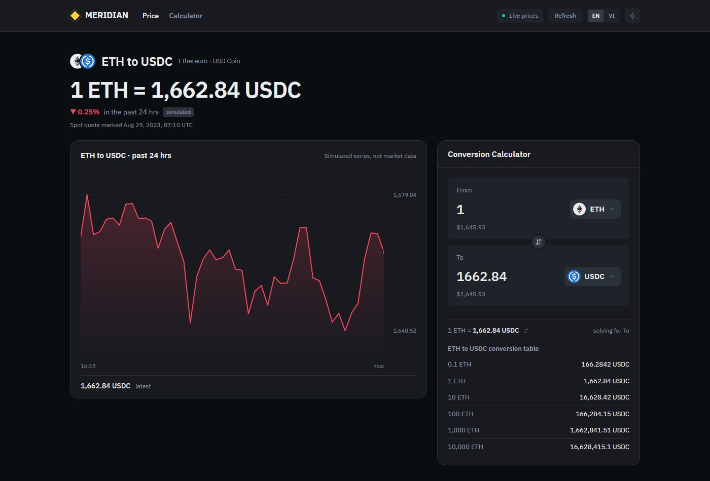

# Problem 2 - Currency Swap Form

A currency price page laid out like an exchange: the pair's rate, a 24-hour
chart, and a conversion calculator.



```bash
npm install
npm run dev      # http://localhost:5173
npm run build
npm test         # vitest, 16 tests
```

## Features

- **Converts both ways** - type into either field and the other solves.
- **32 assets** with a searchable, keyboard-driven picker; picking the asset on
  the other side flips the pair.
- **Reverse button**, and a **conversion table** whose rows fill the input.
- **Validation per keystroke** - letters, a stray decimal point and over
  8 decimals are refused before they land.
- **24-hour chart** - inline SVG with a hover crosshair.
- **English / Vietnamese**, **light / dark**, responsive to 390px, WCAG AA
  contrast in both themes.

## Technical stack

**Vite 6** (the brief's bonus) · **React 18** · **TypeScript 5** strict ·
**Tailwind CSS 4** (CSS-first `@theme`) · **motion** via `LazyMotion` ·
**Vitest** + Testing Library · **ESLint 10** + Prettier. i18n is ~85 lines of
local typed code, no library.

Prices from [interview.switcheo.com](https://interview.switcheo.com/prices.json)
with a committed snapshot as fallback; icons from
[Switcheo/token-icons](https://github.com/Switcheo/token-icons), vendored.

## Notes

- **The 24-hour chart is simulated** and labelled as such on screen - the feed
  has one spot quote per token and no history. It is not market data.
- **This converts; it does not transact.** The template's `CONFIRM SWAP` button,
  a demo wallet and settlement existed earlier and were removed on request.
- **No fee or spread** - it converts at the marked rate and nothing else.
