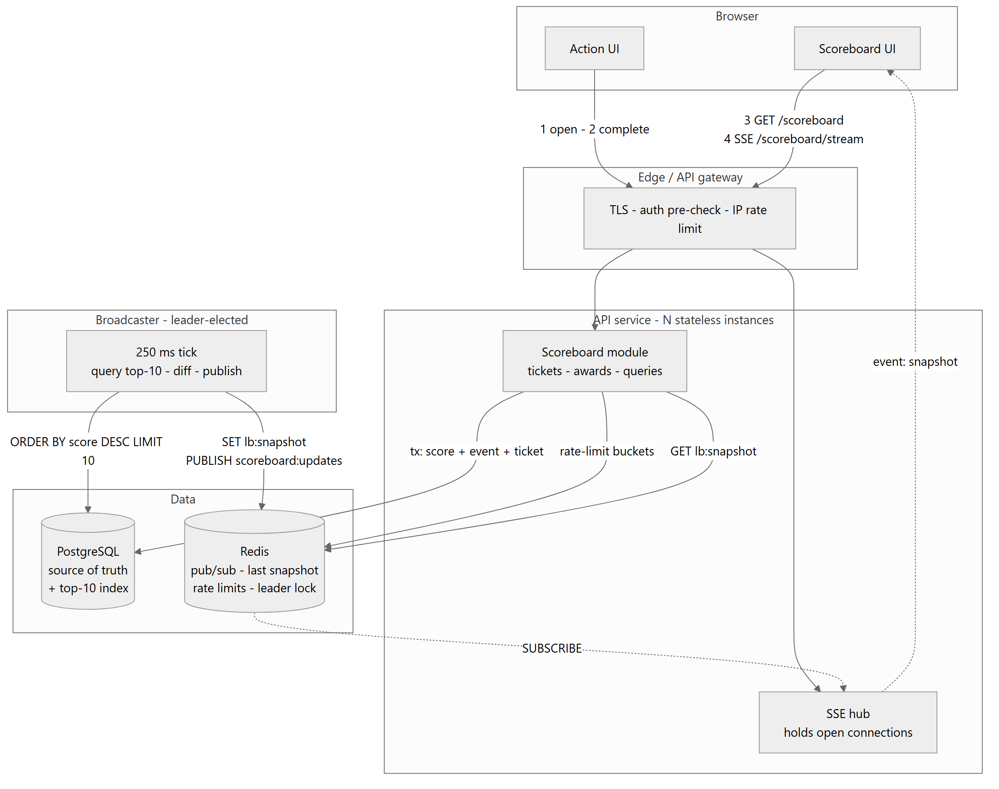

# Problem 6 - Scoreboard Module

Specification for the **Scoreboard** module of the API service: it owns user
scores, awards them, and pushes the top 10 to every connected browser live.

Sections 1-3 are below and the rest are in `docs/`. The section numbers stay
put no matter how the files are arranged, so a reference like "(6.1)" always
resolves - the second table says which document to open.

| Req | Requirement | Addressed in |
|---|---|---|
| 1 | Scoreboard shows the top 10 scores | 5.3, 5.4, 7.1 |
| 2 | Live update of the scoreboard | 5.4, 7.3, 7.4 |
| 3 | Completing an action increases the user's score | 4.1, 5.1, 5.2 |
| 4 | Completion dispatches an API call to update the score | 5.2, 6.1 |
| 5 | Prevent unauthorised score increases | 1, 6.1, 6.2, 8 |

| Sections | Document |
|---|---|
| 4 | [Data model](docs/01-data-model.md) |
| 5 | [API](docs/02-api.md) |
| 6 | [Flow of execution](docs/03-flow.md) |
| 7 | [Implementation notes](docs/04-implementation.md) |
| 8 | [Security](docs/05-security.md) |
| 9, 10 | [Operations](docs/06-operations.md) |
| 11 | [Acceptance criteria](docs/07-acceptance.md) |
| 12 | [Comments and improvements](docs/08-improvements.md) |

---

## 1. The two rules everything else follows from

Requirement 5 - stopping people awarding themselves points - is not a feature
bolted onto an endpoint afterwards. It decides what the endpoint looks like.

1. **The client never sends a score, or a delta.** The award is looked up on the
   server from an action catalogue, so there is simply no number in the payload
   for anyone to inflate.
2. **Every increment redeems a single-use ticket the server issued.** The action
   is *opened* through the API before it is *completed*. The completion presents
   the ticket, the server flips it from `ISSUED` to `REDEEMED` and awards
   whatever the catalogue says. Replay the request and it awards nothing (6.3).

The rest of this specification is largely the mechanical consequence of those
two.

---

## 2. Scope

| In scope | Out of scope |
|---|---|
| Issuing and redeeming action tickets | Authenticating users - an identity service issues the tokens, this module only verifies them |
| The authoritative score per user | What the action *is*, or its business logic |
| The top-10 leaderboard snapshot | Presentation, display names, avatars |
| A live update channel | Seasonal and friend leaderboards (12.6) |
| An append-only audit trail of every award | Anti-cheat heuristics beyond the limits in 9 |

`/scoreboard/stream` streams one thing. It is not a general event bus.

---

## 3. Architecture

source: [`docs/diagrams/01-architecture.mmd`](docs/diagrams/01-architecture.mmd)

The API instances are stateless. The only thing they hold is the set of open SSE
connections, and those are disposable - a client that loses one reconnects and
bootstraps again. The broadcaster is a singleton *by election* rather than by
deployment: every instance runs the loop, but only whoever holds the Redis lock
publishes (7.4).

**Postgres is the source of truth, and it also computes the top 10.** With the
index in 4.1 that is a ten-row index scan, run four times a second by a single
process. Redis does the rest - the bus, the cache of the last snapshot, the
rate-limit counters, the leader lock - and none of it is durable (9.4). If you
are wondering why the leaderboard is not a Redis sorted set, that is 12.8.
