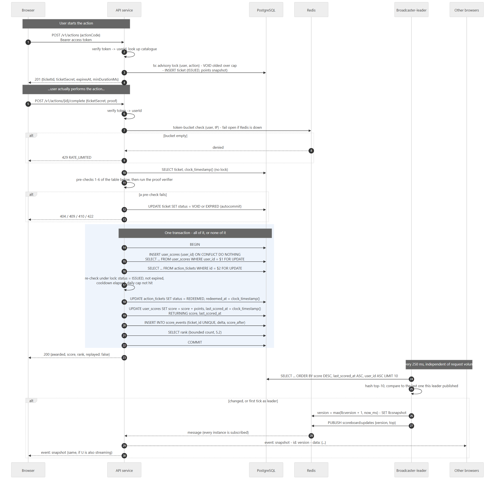
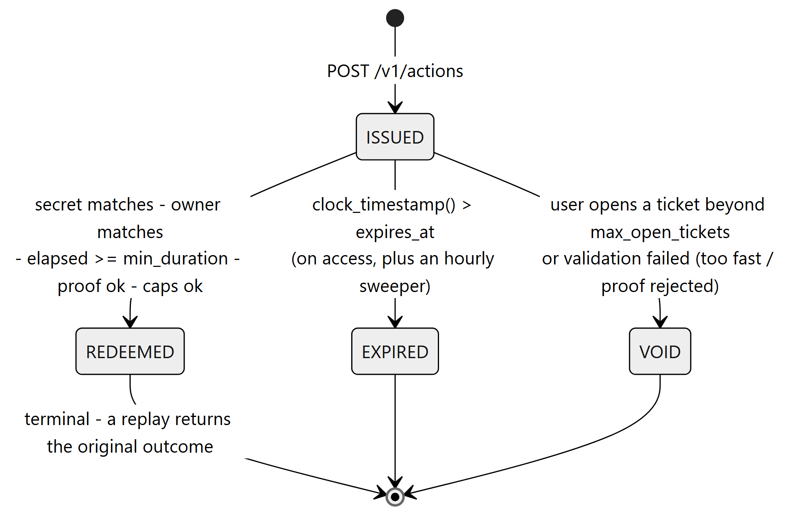
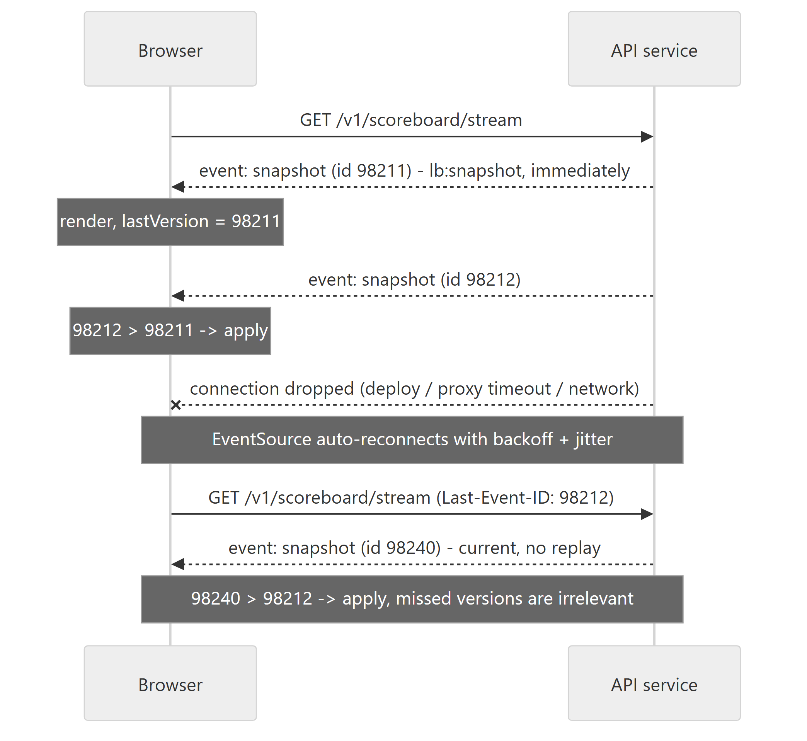

# Flow of execution

[Scoreboard module spec](../README.md) - section 6

## 6. Flow of execution

### 6.1 The main path

source: [`diagrams/02-flow-of-execution.mmd`](diagrams/02-flow-of-execution.mmd)

**The redemption checks run in this order**, and the order is part of the
contract: it decides which error the client sees, and which checks are cheap
enough to run before a lock is taken.

| # | Check | On failure | Where |
|---|---|---|---|
| 1 | Token valid | 401 | before anything |
| 2 | Body matches the closed schema | 400 | before anything |
| 3 | Token buckets (user, IP) | 429 | Redis; fail open (9.2) |
| 4 | Ticket exists, `user_id` = subject, `sha256(secret)` = `secret_hash` (constant-time) | 404, one message for all three | unlocked read |
| 5 | Status: `REDEEMED` -> replay (6.3); `VOID` -> 409; `EXPIRED` or `clock_timestamp() > expires_at` -> mark `EXPIRED`, 410 | as listed | unlocked read |
| 6 | `clock_timestamp() - issued_at >= min_duration_ms` | mark `VOID`, 422 | unlocked read |
| 7 | Proof verifier accepts `(ticket, proof, userId)` | mark `VOID`, 422 | **outside** the transaction (7.2, 8.2) |
| 8 | Re-check 5 under the ticket row lock | as in 5 | in transaction |
| 9 | Cooldown: newest `score_events` for (user, action) older than `cooldown_ms` | 429, ticket untouched | in transaction, after the `user_scores` lock |
| 10 | Daily cap: `score_events` since 00:00 UTC < `daily_cap` | 429, ticket untouched | in transaction, after the `user_scores` lock |

Checks 9 and 10 deliberately run after the `user_scores` lock. That serialises
one user's completions, so two of them cannot both look at a cap with one slot
left and both decide they fit.

**Lock order is always `user_scores` and then `action_tickets`**, and the open
path never takes a `user_scores` lock at all, so the two cannot deadlock. One
subtlety there is easy to get wrong: the void must be
`UPDATE ... WHERE status = 'ISSUED'` on the row itself, not only in the subquery
that picks the oldest ticket. When that update blocks behind a redemption of the
same ticket, Postgres re-evaluates only the row-level predicate against the
committed row, and a ticket that has just become `REDEEMED` must not be
overwritten to `VOID`.

**Failed validations commit.** "All or nothing" applies to the award, not to
everything the request touches. A ticket voided by a failed check is written in
its own autocommit statement *before* the error goes back, because otherwise the
attacker simply retries until `min_duration_ms` has elapsed.

A `200` therefore means the score is durably recorded. It commits before the
broadcast, and nothing is written to a second store afterwards, so a process
dying a microsecond after `COMMIT` changes nothing about what the next tick
publishes.

### 6.2 Ticket lifecycle

source: [`diagrams/03-ticket-lifecycle.mmd`](diagrams/03-ticket-lifecycle.mmd)

`ISSUED -> REDEEMED` is the only transition that moves a score, it is guarded by
`SELECT ... FOR UPDATE`, and it is terminal. That is the entire anti-replay
argument.

An hourly sweeper marks tickets `EXPIRED` over the partial index in 4.1, but it
is hygiene rather than correctness - expired tickets are refused on access
whether or not it has been round.

### 6.3 Retry vs. replay - the ticket is the idempotency key

An honest retry after a network timeout and an attacker's replay are
byte-identical, right down to any `Idempotency-Key` the client might add, since
the attacker captured that header too. So this module does not use one, and does
not need to: `score_events.ticket_id` is `UNIQUE`, which means the original
outcome is already on disk under the one key both parties hold.

- **Ticket `REDEEMED` and the secret is correct:** `200` with `replayed: true`,
  the original `awarded` and `score` read back from `score_events`, and
  `rank: null`. Nothing new is awarded. `ticket_replays_total` counts both
  cases, which makes it a signal to watch (10) rather than grounds to punish
  anyone - the two are indistinguishable by construction.
- **Wrong secret or wrong owner:** `404`, the same as any ticket the caller
  cannot redeem.

### 6.4 Client connection lifecycle

source: [`diagrams/04-client-lifecycle.mmd`](diagrams/04-client-lifecycle.mmd)

Since every message is a complete snapshot, catching up after a disconnect is a
no-op. There is no gap detection and no replay buffer to maintain.
